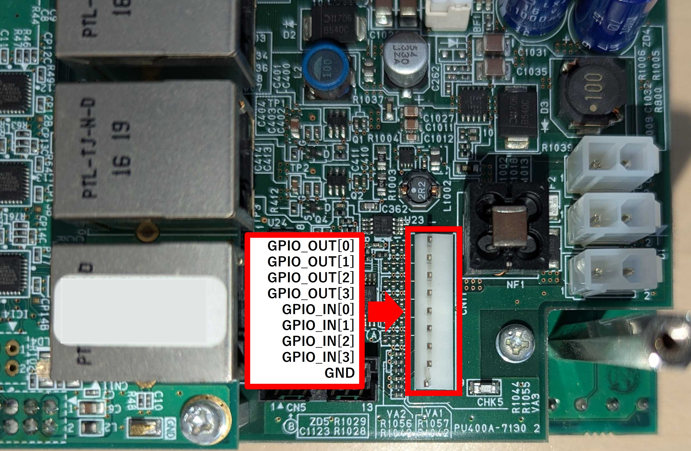
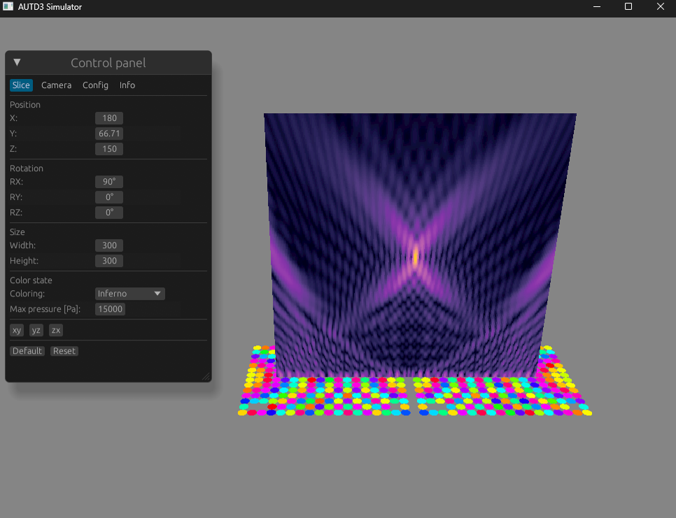

# AUTD3 講習会

鈴木 颯
東京大学 篠田・牧野研究室 特任助教
2025/05/08

---

## はじめに

- 本スライドで扱うのは以下のバージョンです
  - Firmware version 11.0.0
  - Software version 32.1.1

- Softwareの使い方の話はしません
  - [ドキュメント](https://shinolab.github.io/autd3-doc/jp/index.html)を参照してください

- autd3の情報は https://github.com/shinolab/autd3 に集約されています

- スライド自体のソースは https://github.com/shinolab/autd3-lecture.git にあります

---

## AUTD3とは

- AUTD3: Airborne Ultrasound Tactile Display ver. 3
- 超音波の振幅/位相を制御することで, 空間に様々な音場を生成
- 音響放射圧を利用して, 人体の表面を非接触で押すことが主な目的
- AUTD3は複数デバイスを連結して一つの大きなPhased arrayを構成することが可能
- Tactile以外の用途で使う時は, Airborne Ultrasound Phased Arrayとも呼んでる
  - ただし, デバイス名はあくまでもAUTD3

---

## 超音波フェーズドアレイの原理

<canvas id="demo"></canvas>

- フェーズドアレイとは？
  - 位相を個別に制御できる振動子の配列
  - 典型的には格子状に配列

- 位相 ($\sim$音の出るタイミング) を制御し, 音の干渉を利用して音場を生成

---

## AUTD3のアーキテクチャ

<object type="image/svg+xml" data="autd3-arch.svg" height="450"></object>

- AUTD3デバイスは以下の3つから構成される
  - CPUボード$^1$: 主に通信を担当
  - FPGA: 主に駆動信号生成を担当
  - 振動子アレイ

>>> 1: AP-RZT-0A, Alpha Project Co.,Ltd. 要はマイコンボード

---

## 単一デバイスの動作について

あるいはFPGAファームウェアのアーキテクチャ

---
 
## AUTD3のアーキテクチャ in FPGA

<object type="image/svg+xml" data="sig-gen.svg" width="1100"></object>

---

## PWMモジュール

AUTD3のアーキテクチャ in FPGA

<object type="image/svg+xml" data="sig-gen-pwm.svg" width="400"></object>

- PWMモジュールはパルス幅と位相データを受け取って駆動信号を生成する

---

## PWM?

  

      

          <label for="dutySlider">Duty比:</label>
          <input type="range" id="dutySlider" min="0" max="1" step="0.01" value="0.5">
          0.50
      

      

          <label for="phaseSlider">位相:</label>
          <input type="range" id="phaseSliderRad" min="0" max="2" step="0.01" value="1">
          π
      

  

  

      <h2>矩形波 (PWM信号)</h2>
      <canvas id="rectWaveCanvas" width="400" height="150"></canvas>
  

  

      <h2>基本波成分 (正弦波)</h2>
      <canvas id="sineWaveCanvas" width="400" height="150"></canvas>
  

- PWM: Pulse Width Modulation
  - 矩形波のDuty比 (パルス幅 / 周期) を変えることで, 超音波の出力を変化させる手法

- Duty比 $=0.5$の時, 出力が最大
  - Duty比は$[0, 0.5]$の範囲で単調増加

- AUTD3では, 周期 $=512$としている
  - 位相は2倍して使う $([0,255]\rightarrow[0,510])$
  - パルス幅は9bit必要$([0,256])$

---

## Pulse Width Encoder

AUTD3のアーキテクチャ in FPGA

<object type="image/svg+xml" data="sig-gen-pwe.svg" width="320"></object>

- 入力: 強度データ (8bit), 出力: パルス幅 (9bit)
  - パルス幅と出力振幅の非線形性の補正
  - 8bitデータ $([0,255])$を9bitデータ $([0,256])$に

- PWMにおける非線形性$^1$: $A \propto \sin\left(\pi\frac{D}{512}\right)$
  - $A$: 出力振幅, $D$: パルス幅

- 実体は強度$E$をアドレス, パルス幅$D$をデータとするテーブル (書き換え可)
  - デフォルトだと$D=\left[\frac{512}{\pi}\arcsin\left(\frac{E}{255}\right)\right]$

>>> 1: 理論上. 実測では$A \propto \sin^\alpha\left(\pi\frac{D}{512}\right),\alpha=0.83$とか.

---

## Silencer

AUTD3のアーキテクチャ in FPGA

<object type="image/svg+xml" data="sig-gen-silencer.svg" width="400"></object>

- 強度, 位相の急峻な変化を抑えるモジュール
  - これによって, 可聴音ノイズを抑制する$^1$

>>> 1: Suzuki, Shun, et al. “Reducing amplitude fluctuation by gradual phase shift in midair ultrasound haptics.” IEEE transactions on haptics 13.1 (2020): 87-93.

---

## Silencerによる位相変化抑制

AUTD3のアーキテクチャ in FPGA: Silencer

<object type="image/svg+xml" data="silencer_normal.svg" width="400"></object>

- 左の図は, 周期$T=12$の場合, $t=t_s$で位相$P$が$2$から$6$に変化した場合

- 基本的に単純移動平均フィルタと同じ
  - ただし, **位相の周期性を考慮する**
  - また, 途中で目標値が動的に変わる場合も異なる挙動になる

---

## Silencerによる位相変化抑制 - 位相の周期性

AUTD3のアーキテクチャ in FPGA: Silencer

<object type="image/svg+xml" data="silencer_wrap.svg" width="400"></object>

- 左の図は, 周期$T=12$の場合, $t=t_s$で位相$P$が$2$から$10$に変化した場合
  - これは, $P=2$からは$P=10$よりも$P=-2$の方が近いため

---

## Silencerによる位相変化抑制 - 動的な更新

AUTD3のアーキテクチャ in FPGA: Silencer

<object type="image/svg+xml" data="silencer_dynamic.svg" width="400"></object>

- 途中でもう一度位相が変化する場合の挙動は, 移動平均フィルタとは異なる

  - AUTD3の実装では, 現在の値 (=直前の出力) と 現在の入力値しか考慮しない

---

## Silencerのモード

AUTD3のアーキテクチャ in FPGA: Silencer

<object type="image/svg+xml" data="silencer_delta.svg" width="360"></object>

- Silencerのニ種類のモード
  - Fixed Update Rateモード: $\Delta$が全振動子で固定
  - Fixed Completion Stepsモード: $\Delta T$が全振動子で固定

- $\Delta$が小さい, あるいは, $\Delta T$が大きいほど騒音は抑制
  - 更新ステップは$25\,\mathrm{\micro s}$で固定

- Silencer内部では, より細かい制御を可能にするため, 強度$E$, 位相$P$を256倍している

---

## Modulation

AUTD3のアーキテクチャ in FPGA

<object type="image/svg+xml" data="sig-gen-modulation.svg" width="320"></object>

- 強度データ$E$に8bitの変調データ$M$をかけ合わせるモジュール
  - 正確には$\frac{E\times M}{255}$
  - これにより, Amplitude Modulationを実現する

- 変調データは最大長65536のメモリに書き込まれたデータが順次サンプルされる
  - データは$\frac{40\,\mathrm{kHz}}{d_\textrm{m}}$の周波数でサンプルされる (=この周波数で読み出しアドレスがインクリメント)

---

## STM

AUTD3のアーキテクチャ in FPGA

<object type="image/svg+xml" data="sig-gen-stm.svg" width="260"></object>

- 強度データ$E$と位相データ$P$を出力するモジュール

- STMデータもメモリに書き込まれたデータが順次サンプルされる
  - データは$\frac{40\,\mathrm{kHz}}{d_\textrm{s}}$の周波数でサンプルされる

- STMには2種類のモードがある
  - GainSTMモード: 書き込まれたデータをそのまま出力する
  - FociSTMモード: 書き込まれたデータを焦点列とみなす

---

## GainSTM

AUTD3のアーキテクチャ in FPGA: STM

<object type="image/svg+xml" data="stm-foci.svg" width="200"></object>

- $E_n[k]$: $k$番目のGainの$n$番目の振動子の強度データ
- $P_n[k]$: $k$番目のGainの$n$番目の振動子の位相データ

- このモードは柔軟だがメモリの使用量が大きい
  - メモリサイズ: $524288\,\mathrm{byte}$, 1Gainあたり強度位相に$2\,\mathrm{byte}\times 249$ → 最大で$\frac{524288}{2\times 249}=1052$個のGainを格納できる
  - 実際には切りよく1024個 ($k=0,1,...,1023$)

---

## FociSTM

AUTD3のアーキテクチャ in FPGA: STM

<object type="image/svg+xml" data="stm-foci.svg" width="200"></object>

- $F_x[k],F_y[k],F_z[k]$: $k$番目の焦点の座標データ
  - 具体的には, それぞれ18bitの符号あり固定小数点数 (単位$0.025\,\mathrm{mm}$)
- $E[k]$: $k$番目の焦点の強度データ (全振動子で共通)

- このモードは焦点しか出せないがメモリの使用量が少ない
  - メモリサイズ: $524288\,\mathrm{byte}$, 1焦点あたりに$18\times 3 + 8\,\mathrm{bit}$ → 最大で$\frac{524288\times 8}{18 \times 3 +8}=76260$個の焦点を格納できる
  - 実際には切りよく65536個 ($k=0,1,...,65535$)

---
 
## AUTD3の動作モデルまとめ

<object type="image/svg+xml" data="sig-gen.svg" width="1100"></object>

---

## 補足①: Silencerによる位相変化抑制再考

<object type="image/svg+xml" data="silencer_dynamic.svg" width="300"></object>
<object type="image/svg+xml" data="silencer_delta.svg" width="300"></object>

- 途中でもう一度位相が変化する場合の挙動は, 移動平均フィルタとは異なる
  - 以下の条件を満たす場合, これが起きることはない
    - 変調のサンプリング周期$25\,\mathrm{\micro s}\times d_\mathrm{m} \ge \Delta T$
    - STMのサンプリング周期$25\,\mathrm{\micro s}\times d_\mathrm{s} \ge \Delta T$

- デフォルトでは上記の条件を満たさないようなサンプリング設定に対してエラーを返すようになっている
  - 位相に対して$\Delta T=1\,\mathrm{ms}$, 強度データに対して$\Delta T=0.25\,\mathrm{ms}$

---

## 補足②: 冷却用ファン

- ファン横のジャンパスイッチでモードを切り替えられる
  - 図左: Auto (温度センサで制御)
  - 図中: 常時OFF
  - 図右: 常時ON

- Autoモードの場合, 一定温度を超えるとファンが回る
  - あるいは, ForceFan信号で強制的にOnにできる$^1$

>>> 1: 強制Offはできない

---

## 補足③: GPIOピン

- 4入力4出力のGPIOピンがある
- 入力は現在, セグメントの切り替えトリガにしか使ってない
- 出力としては, 指定した振動子の駆動信号等を出力できる$^1$

>>> 1: 詳細は[ドキュメント](https://shinolab.github.io/autd3-doc/jp/Users_Manual/API/gpio_out.html)を参照

---

## 複数デバイスの動作について

あるいはEtherCATについて

---

## EtherCAT

<object type="image/svg+xml" data="autd3-arch-ethercat.svg" width="400"></object>

- AUTD3は通信プロトコルにEtherCATを採用
- EtherCAT: Beckhoff社が開発したフィールドバスシステム
  - Ethernet上に構築
  - リアルタイム$^1$
  - 分散同期クロック (DC: Distributed Clock) を提供
    - 精度はsub-μsオーダー

>>> 1: リアルタイム: 所定の時間内に処理が完了すること

---

## EtherCAT: 分散クロック

<object type="image/svg+xml" data="ethercat-dc.svg" width="360"></object>

- 一般に, クロック同士は同期しない
  - 同時にスタートできない
  - 周波数が微妙に違う

- データの送受信の際, その時刻を測定すると以下の関係が成り立つ$^1$
  - $t^2_r + t_\text{offset} = t^1_s + t_\text{delay}$
  - $t^1_r + t_\text{offset} = t^2_s + t_\text{delay}$

- これから$t^1$と$t^2$のクロックずれ $t_\text{offset}$ を求める
  - これを以て各slaveのクロックずれを補正$^2$

>>> 1: 通信ディレイ$t_\text{delay}$は送受信で同じと仮定
>>> 2: 実際には他にも色々やってる

---

## EtherCATの通信モデル

<object type="image/svg+xml" data="autd3-arch-ethercat.svg" width="400"></object>

- リング状になってる通信路上を固定長のフレームを常にぶん回すことで通信する
  - 各slaveはそのフレームをon-the-flyで処理
  - この処理のため特殊なESC (EtherCAT Slave Controller) が必要
- これによって, レイテンシを最小にしつつリアルタイム通信を実現
- EtherCAT masterは, 一定の間隔でフレームを送信することが求められる

---

## TwinCAT: Beckhoff社のEtherCAT master

- EtherCATの本家であるBeckhoff社が提供しているEtherCAT master
- Windowsでのみ動作する$^1$
  - Windows NTカーネルを拡張してリアルタイム性を実現しているらしい$^2$
- リアルタイム動作を保証するためにIntel製のEthernet Controllerを要求

>>> 1: 最近 (2024年4月) TwinCAT runtime for real-time Linuxが発表された. Q3 2025にリリース予定?
>>> 2: https://infosys.beckhoff.com/english.php?content=../content/1033/tcsystemover/12695813131.html&id=2075408258360613694

---

## SOEM: Simple Open EtherCAT Master

- Open sourceで開発されているEtherCAT master
  - TwinCAT以外だとほぼ唯一の選択肢$^1$
- 通常のWindows/Linux/macOS上で動作する
  - そのためリアルタイム性の保証はない

>>> 1: 最近, [EtherCrab](https://github.com/ethercrab-rs/ethercrab)という新しいEtherCAT masterが登場したものの, まだAUTD3がちゃんと動かなかった

---

## FPGA間の同期

<object type="image/svg+xml" data="autd3-arch-cpu-fpga.svg" width="400"></object>

- 基本的に, CPUボード上のEtherCATのDCシステム時刻をFPGA側にコピーしている$^1$
  - EtherCATのシステム時刻の単位は$1\,\mathrm{ns}$, FPGA内部では$\frac{1}{20.48\,\mathrm{MHz}}$単位に変換$^2$

- PWM信号の生成や, STM/Modulationのサンプリングはこのシステム時刻を利用する
  - EtherCATのシステム時刻が同期しているので, これらも自動的に同期する

>>> 1: 実際にはもっと色々やってるけど割愛. [AUTD3のドキュメント](https://shinolab.github.io/autd3-doc/jp/Developer_Manual/fpga/sync.html)を参照.
>>> 2: $20.48\,\mathrm{MHz} = 512\times 40\,\mathrm{kHz}$

---

## FPGA間の同期: PWM

- PWM信号を生成するには, $t=0,1,2,...,T-1$を周期的にカウントするカウンタが必要になる
- これは, 同期システム時刻$t_\text{system}$に対して$t = t_\text{system}\ \mathrm{mod}\ 512$を計算すればいい$^1$
  - $a\ \mathrm{mod}\ b$は$a$を$b$で割った余り
- $t_\text{system}$が同期しているので, $t$も同期する

>>> 1: これは下位9bitを取り出す処理に等しい

---

## FPGA間の同期: STM/Modulation

- STM/Modulationのサンプリングは, そのインデックス$i$を$i = \left\lfloor\frac{t_\text{system}}{512 \times d}\right\rfloor\ \mathrm{mod}\ c$で計算すればいい
  - ここで, $d$はサンプリング分周比, $c$は周期
  - $i=0,1,2,...,c-1$まで, $\frac{20.48\,\mathrm{MHz}}{512 \times d}=\frac{40\,\mathrm{kHz}}{d}$の周波数で周期的にインクリメントされる 

---

## 複数デバイスの動作まとめ

<object type="image/svg+xml" data="autd3-arch-summary.svg" width="400"></object>

- 通信にはEtherCATを採用
  - 通信を制御するEtherCAT masterにはTwinCATとSOEMがある

- FPGAはEtherCATが提供するDCシステム時刻を利用して同期
  - PWM信号の生成や, STM/Modulationのサンプリングはこのシステム時刻を利用する
  - EtherCATのDCシステム時刻が同期しているので, これらも自動的に同期する

---

## 補足①: EtherCAT詳解: EtherCAT通信タイミング

<object type="image/svg+xml" data="ecat-timing.svg" width="500" height="450"></object>

- Sync0: EtherCATのDCシステム時刻から生成される同期信号
  - FPGAのシステム時刻補正にも使う

- EtherCATのデータ処理は**同期**
- AUTD3のデータ処理タイミングは**非同期**

 

---

## 補足①: EtherCAT詳解: EtherCAT state

- EtherCAT slaveの状態
  - Init: 初期状態
  - Pre-Op: 準備状態
  - Safe-Op: 安全運転状態
  - Op: 運転状態

- Op状態でないと, EtherCAT Slaveはデータを受信処理しない

- 障害が起こる (データが所定の時間内に受信されない等) と, Safe-Op状態に遷移

>>> ECSファームウェア書き換えに使うBootstrap状態もある

---

## 補足①: EtherCAT詳解: TwinCATのパラメータ

- Sync0 Cycle: Sync0の周期デフォは$1\,\mathrm{ms}$. 
- Send Cycle: データ送信処理の周期. デフォは$1\,\mathrm{ms}^1$. 
  - データ受信処理がSync0に同期するため, デバイス数が増える場合等は, これらの値を増やす必要がある場合がある

- CPU base time: TwinCAT 3のリアルタイムタスクの処理間隔. デフォは$1\,\mathrm{ms}^1$. 
  - Send Cycleはこれの整数倍のみ

>>> [Beckhoff曰く](https://infosys.beckhoff.com/english.php?content=../content/1033/tcsystemmanager/1086417035.html&id=), 必要なければ$1\,\mathrm{ms}^1$推奨

---

## 補足②: STM/Modulationのメモリセグメントについて

- STM/Modulationは同期のために, 周期的な動作を基本としている
  - STM/Modulationのサンプリングインデックス$i$は$i = \left\lfloor\frac{t_\text{system}}{512 \times d}\right\rfloor\ \mathrm{mod}\ c$で決定される

- そのため, 例えば, ある瞬間に「今から一周期分だけ出力してください」みたいな動作がこのままだとできない
  - 開始地点が制御できない

- これを実現するために, STM/Modulationのメモリには2つのセグメントが用意されており, このセグメントを切り替えるタイミングを制御することで, 上記のような動作を実現する

---

## セグメントの切り替え: SyncIdx

補足②: STM/Modulationのメモリセグメントについて

    

        
Segment 0

        <svg style="vertical-align: -0.357ex;" xmlns="http://www.w3.org/2000/svg" width="6.143ex" height="1.927ex" role="img" focusable="false" viewBox="0 -694 2715.2 851.8"><g stroke="currentColor" fill="currentColor" stroke-width="0" transform="scale(1,-1)"><g data-mml-node="math"><g data-mml-node="msub"><g data-mml-node="mi"><path data-c="1D451" d="M366 683Q367 683 438 688T511 694Q523 694 523 686Q523 679 450 384T375 83T374 68Q374 26 402 26Q411 27 422 35Q443 55 463 131Q469 151 473 152Q475 153 483 153H487H491Q506 153 506 145Q506 140 503 129Q490 79 473 48T445 8T417 -8Q409 -10 393 -10Q359 -10 336 5T306 36L300 51Q299 52 296 50Q294 48 292 46Q233 -10 172 -10Q117 -10 75 30T33 157Q33 205 53 255T101 341Q148 398 195 420T280 442Q336 442 364 400Q369 394 369 396Q370 400 396 505T424 616Q424 629 417 632T378 637H357Q351 643 351 645T353 664Q358 683 366 683ZM352 326Q329 405 277 405Q242 405 210 374T160 293Q131 214 119 129Q119 126 119 118T118 106Q118 61 136 44T179 26Q233 26 290 98L298 109L352 326Z"></path></g><g data-mml-node="mtext" transform="translate(553,-150) scale(0.707)"><path data-c="73" d="M295 316Q295 356 268 385T190 414Q154 414 128 401Q98 382 98 349Q97 344 98 336T114 312T157 287Q175 282 201 278T245 269T277 256Q294 248 310 236T342 195T359 133Q359 71 321 31T198 -10H190Q138 -10 94 26L86 19L77 10Q71 4 65 -1L54 -11H46H42Q39 -11 33 -5V74V132Q33 153 35 157T45 162H54Q66 162 70 158T75 146T82 119T101 77Q136 26 198 26Q295 26 295 104Q295 133 277 151Q257 175 194 187T111 210Q75 227 54 256T33 318Q33 357 50 384T93 424T143 442T187 447H198Q238 447 268 432L283 424L292 431Q302 440 314 448H322H326Q329 448 335 442V310L329 304H301Q295 310 295 316Z"></path></g></g><g data-mml-node="mo" transform="translate(1159.4,0)"><path data-c="3D" d="M56 347Q56 360 70 367H707Q722 359 722 347Q722 336 708 328L390 327H72Q56 332 56 347ZM56 153Q56 168 72 173H708Q722 163 722 153Q722 140 707 133H70Q56 140 56 153Z"></path></g><g data-mml-node="mn" transform="translate(2215.2,0)"><path data-c="31" d="M213 578L200 573Q186 568 160 563T102 556H83V602H102Q149 604 189 617T245 641T273 663Q275 666 285 666Q294 666 302 660V361L303 61Q310 54 315 52T339 48T401 46H427V0H416Q395 3 257 3Q121 3 100 0H88V46H114Q136 46 152 46T177 47T193 50T201 52T207 57T213 61V578Z"></path></g></g></g></svg>
        

            

                
Addr

            

            

                
0

            

            

                
1

            

            

                
2

            

            

                
3

            

        

    

    

        
Segment 1

        <svg style="vertical-align: -0.357ex;" xmlns="http://www.w3.org/2000/svg" width="6.143ex" height="1.927ex" role="img" focusable="false" viewBox="0 -694 2715.2 851.8"><g stroke="currentColor" fill="currentColor" stroke-width="0" transform="scale(1,-1)"><g data-mml-node="math"><g data-mml-node="msub"><g data-mml-node="mi"><path data-c="1D451" d="M366 683Q367 683 438 688T511 694Q523 694 523 686Q523 679 450 384T375 83T374 68Q374 26 402 26Q411 27 422 35Q443 55 463 131Q469 151 473 152Q475 153 483 153H487H491Q506 153 506 145Q506 140 503 129Q490 79 473 48T445 8T417 -8Q409 -10 393 -10Q359 -10 336 5T306 36L300 51Q299 52 296 50Q294 48 292 46Q233 -10 172 -10Q117 -10 75 30T33 157Q33 205 53 255T101 341Q148 398 195 420T280 442Q336 442 364 400Q369 394 369 396Q370 400 396 505T424 616Q424 629 417 632T378 637H357Q351 643 351 645T353 664Q358 683 366 683ZM352 326Q329 405 277 405Q242 405 210 374T160 293Q131 214 119 129Q119 126 119 118T118 106Q118 61 136 44T179 26Q233 26 290 98L298 109L352 326Z"></path></g><g data-mml-node="mtext" transform="translate(553,-150) scale(0.707)"><path data-c="73" d="M295 316Q295 356 268 385T190 414Q154 414 128 401Q98 382 98 349Q97 344 98 336T114 312T157 287Q175 282 201 278T245 269T277 256Q294 248 310 236T342 195T359 133Q359 71 321 31T198 -10H190Q138 -10 94 26L86 19L77 10Q71 4 65 -1L54 -11H46H42Q39 -11 33 -5V74V132Q33 153 35 157T45 162H54Q66 162 70 158T75 146T82 119T101 77Q136 26 198 26Q295 26 295 104Q295 133 277 151Q257 175 194 187T111 210Q75 227 54 256T33 318Q33 357 50 384T93 424T143 442T187 447H198Q238 447 268 432L283 424L292 431Q302 440 314 448H322H326Q329 448 335 442V310L329 304H301Q295 310 295 316Z"></path></g></g><g data-mml-node="mo" transform="translate(1159.4,0)"><path data-c="3D" d="M56 347Q56 360 70 367H707Q722 359 722 347Q722 336 708 328L390 327H72Q56 332 56 347ZM56 153Q56 168 72 173H708Q722 163 722 153Q722 140 707 133H70Q56 140 56 153Z"></path></g><g data-mml-node="mn" transform="translate(2215.2,0)"><path data-c="32" d="M109 429Q82 429 66 447T50 491Q50 562 103 614T235 666Q326 666 387 610T449 465Q449 422 429 383T381 315T301 241Q265 210 201 149L142 93L218 92Q375 92 385 97Q392 99 409 186V189H449V186Q448 183 436 95T421 3V0H50V19V31Q50 38 56 46T86 81Q115 113 136 137Q145 147 170 174T204 211T233 244T261 278T284 308T305 340T320 369T333 401T340 431T343 464Q343 527 309 573T212 619Q179 619 154 602T119 569T109 550Q109 549 114 549Q132 549 151 535T170 489Q170 464 154 447T109 429Z"></path></g></g></g></svg>
        

            

                
Addr

            

            

                
0

            

            

                
1

            

            

                
2

            

            

                
3

            

        

    

    

        
Time: 0

    

    

        <input type="checkbox" id="transitionCheckbox">
        <label for="transitionCheckbox">遷移</label>
    

<button id="stepButton">ステップ実行</button>

- 遷移先セグメントのサンプリングインデックスが0になるタイミングで遷移するモード
- 待ち時間が発生する
- 命令のタイミングによっては, デバイス間で遷移タイミングが1周期分ずれる可能性あり

---

## セグメントの切り替え: SysTime + α

補足②: STM/Modulationのメモリセグメントについて

- SysTime
  - 所定のEtherCATシステム時間に遷移するモード$^1$
  - 余裕を持った未来のタイミングを指定しないと失敗する可能性あり

- GPIOIn
  - GPIOピンへの入力をトリガに遷移するモード

- Ext
  - 2つのセグメント間を自動で切り替えるモード

>>> 1: システム時間がわかれば, オフセットも計算できる

---

## autd3ソフトウェアライブラリについて

---

## autd3ソフトウェアライブラリ

- 実装はすべてRustで書かれている
- 多言語から扱えるように, 上記の実装をC APIとしてラップしたものも提供
  - これをPython, .NET (C#/Unity等), C++用にラップしたライブラリも提供
  - RustのAPIとの一貫性を重視, パフォーマンスは二の次
  - 一部機能は利用不可$^1$

>>> 1: 面倒なので

---

## autd3ソフトウェアライブラリの依存関係

<object type="image/svg+xml" data="software.svg" height="450"></object>

>>> autd3-link-soem, 及び, そのラッパーを分けているのは, SOEMがGPLライセンスなので (例外付きなので大丈夫だとは思うが念の為)

---

## autd3ライブラリの主要コンポーネント

<object type="image/svg+xml" data="software-arch.svg" width="460"></object>

- `Controller`: 制御の中心
  - `Geometry`: `Device`のコンテナ
  - `Device`: `Transducer`のコンテナ
  - `Transducer`: 振動子に対応
  - `Link`: AUTD3デバイスとの通信を担当
- `Gain`: 位相/振幅情報 (の素) を格納
- `GainSTM`/`FociSTM`: STM制御
- `Modulation`: AM変調制御
- `Silencer`: Silencer制御

---

## `Controller`

autd3ライブラリの主要コンポーネント

- 基本的にデバイスの制御はこのクラスを通して行う
  - EtherCATの仕様上, 1フレームで送れる情報は固定長なので, 大きなデータを細かく分ける送信制御とか
- `Controller`から`Geometry`に直接アクセスできる
  - `Geometry`は`Device`のコンテナであり, 現実空間でデバイスがどう置かれているかを管理 
- `Gain`の位相計算とかも実際は`Controller`内部で行ってる
  - 例えば焦点だと, 振動子の位置情報が必要なので

---

## `Link`

autd3ライブラリの主要コンポーネント

デバイスとの通信を担当

- `TwinCAT`: TwinCAT3に通信処理を委託
- `SOEM`: SOEMを利用して通信
- `Simulator`: シミュレータ

---

## `TwinCAT`

autd3ライブラリの主要コンポーネント: Link

<object type="image/svg+xml" data="software-twincat.svg" height="80"></object>

- `TwinCAT` Linkでは実際のEtherCAT通信処理はTwinCAT 3が行う
  - 別途TwinCAT 3を走らせておく必要あり

- `TwinCAT` LinkとTwinCAT 3との間の通信は**EtherCATではない**
  - LAN経由とかでもいい
    - `TwinCAT`はローカルのTwinCAT 3を利用
    - `RemoteTwinCAT`はLAN上の別PCのTwinCAT 3を利用

>>> ADS: Automation Device Specification. Beckhoffの通信プロトコル.

---

## `SOEM`

autd3ライブラリの主要コンポーネント: Link

<object type="image/svg+xml" data="software-soem.svg" height="160"></object>

- `SOEM` LinkはSOEMを内包

- `TwinCAT` Linkみたいに別PCで走らせる用の`RemoteSOEM` Linkもある
 
>>> gRPC: Google Remote Procedure Call. RPCの一種.

---

## `Simualtor`

autd3ライブラリの主要コンポーネント: Link

<object type="image/svg+xml" data="software-simulator.svg" height="80"></object>

- `Simulator` LinkはAUTD3 Simulatorと通信するためのLink
  - AUTD3 Simulatorを走らせておく必要あり

- AUTD3 SimulatorはLAN上の別PCで走らせても良い

---

## `Gain`

autd3ライブラリの主要コンポーネント

各振動子に与える位相/振幅を計算する情報を格納

- `Focus`: 単焦点
- `Bessel`: ベッセルビーム
- `Plane`: 平面波

- `autd3-gain-holo`: 多焦点
  - `Naive`: 単焦点解の重ね合わせ
  - `GS`: Gerchberg-Saxton法
  - `GSPAT`: Gerchberg-Saxton for Phased Array of Transducers
  - `LM`: Levenberg-Marquardt法
  - `Greedy`: 貪欲法

---

## `GainSTM`/`FociSTM`

autd3ライブラリの主要コンポーネント

- `GainSTM`: GainをSTM制御するための情報を格納
  - `Gain`の配列とサンプリング分周比とか
- `FociSTM`: 焦点をSTM制御するための情報を格納
  - 焦点の配列とサンプリング分周比

- なお, 実際にはファームウェア的には`Gain`は周期1の`GainSTM`と等価

---

## `Modulation`

autd3ライブラリの主要コンポーネント

AM変調用のデータ列を計算する情報を格納

- `Static`: 変調なし
- `Sine`: 正弦波
- `Square`: 矩形波

- `autd3-modulation-audio-file`: 音声ファイルからの変調
  - `Wav`: WAVファイル
  - `Csv`: CSVファイル

---

## `Silencer`

autd3ライブラリの主要コンポーネント

<object type="image/svg+xml" data="silencer_delta.svg" width="360"></object>

- 2種類のモードがある
  - `FixedUpdateRate`: 位相/強度に対してそれぞれ$\Delta$を指定
  - `FixedCompletionTime`: 位相/強度に対してそれぞれ$\Delta T$を指定
    - `strict_mode`: `true`の場合, 以下の条件を満たさない場合エラーを返す
        - 変調のサンプリング周期 $\ge \Delta T$
        - STMのサンプリング周期 $\ge \Delta T$

---

## autd3ソフトウェアライブラリまとめ

1. 現実におけるAUTD3デバイスの位置とデバイスと通信するためのLinkを指定して`Controller`を作成
1. `Gain`, `GainSTM`, `FociSTM`, `Modulation`, `Silencer`などなどを`Controller`経由で送信

- 他にも色々あるので, [ドキュメント](https://shinolab.github.io/autd3-doc/jp/)を参照

---

## 補足①: AUTD3 Simulator

- autd3を使用したプログラムの動作確認用シミュレータ

- 音場の可視化を行うことができる
  - ただし, 音場は球面波の線形重ね合わせ
  - 非線形性や振動子の特性, 伝搬遅延, Silencer処理等は考慮されない

---

## 補足②: AUTD3 emulator

- Rust, 及び, Pythonから使用できるエミュレータ

- Simulatorより正確な音場の計算ができる
  - 振動子の特性, 伝搬遅延, Silencer処理等を考慮
  - 非線形性は考慮されない

- 音場の可視化はできない

- Firmware内部のデータ出力もエミュレート可能

---

## おわりに

質問, バグ報告, 追加機能要望等はGitHubのissueでから遠慮なくどうぞ
- バグったときに「バグりました」だけではどうしようもないので, 次の情報があると助かります
  1. 環境 (OSとか使ってるコンパイラのバージョンとか)
  1. 何が起こってるのか (期待している結果と実際の結果の差)
  1. エラーメッセージ (あれば)
  1. エラーを治すために何を試したか (全く何も試してないでも良い, これの意義は二度手間をなくすこと)
  1. 問題のコード
    - バグを再現する最小限のコードだとなお良い
    - たまに画像で送ってくる人いるんですけど, 文字列として送ってください
