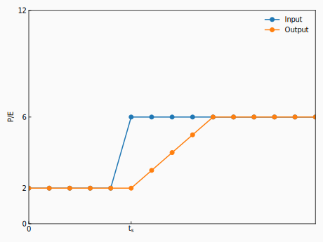
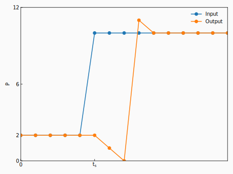

# AUTD3 講習会

鈴木 颯
東京大学 篠田・牧野研究室 特任助教
2025/xx/xx

---

## はじめに

- 本スライドで扱うのは以下のバージョンです
  - Firmware version 11.0.0
  - Software version 32.1.1

- autd3の情報は https://github.com/shinolab/autd3 に集約されています

- スライド自体のソースは https://github.com/shinolab/autd3-lecture.git にあります

---

## AUTD3とは

- AUTD3: Airborne Ultrasound Tactile Display ver. 3
- 超音波の振幅/位相を制御することで, 空間に様々な音場を生成
- 音響放射圧を利用して, 人体の表面を非接触で押すことが主な目的
- AUTD3は複数のデバイスを連結して一つの大きなPhased arrayを構成することが可能
- Tactile以外の用途で使う時は, Airborne Ultrasound Phased Arrayとも呼んでる
  - ただし, デバイス名はあくまでもAUTD3

---

## 超音波フェーズドアレイの原理

<canvas id="demo"></canvas>

- フェーズドアレイとは？
  - 位相を個別に制御できる振動子を配列したもの
  - 典型的には格子状に配列

- 位相 ($\sim$音の出るタイミング) を制御し, 音の干渉を利用して音場を生成

---

## AUTD3のアーキテクチャ

- AUTD3デバイスは以下の3つから構成される
  - CPUボード: 主に通信を担当
  - FPGA: 主に駆動信号生成を担当
  - 振動子アレイ

---

## 単一デバイスの動作について

あるいはFPGAファームウェアのアーキテクチャ

---
 
## AUTD3のアーキテクチャ in FPGA

---

## PWMモジュール

AUTD3のアーキテクチャ in FPGA

- PWMモジュールはパルス幅と位相データを受け取って駆動信号を生成する

---

## PWM?

  

      

          <label for="dutySlider">Duty比:</label>
          <input type="range" id="dutySlider" min="0" max="1" step="0.01" value="0.5">
          0.50
      

      

          <label for="phaseSlider">位相:</label>
          <input type="range" id="phaseSliderRad" min="0" max="2" step="0.01" value="1">
          π
      

  

  

      <h2>矩形波 (PWM信号)</h2>
      <canvas id="rectWaveCanvas" width="400" height="150"></canvas>
  

  

      <h2>基本波成分 (正弦波)</h2>
      <canvas id="sineWaveCanvas" width="400" height="150"></canvas>
  

- PWM: Pulse Width Modulation
  - 矩形波のDuty比 (パルス幅 / 周期) を変えることで, 超音波の出力を変化させる手法

- Duty比 $=0.5$の時, 出力が最大
  - Duty比は$[0, 0.5]$の範囲で単調増加

- AUTD3では, 周期 $=512$としている
  - 位相は2倍して使う $([0,255]\rightarrow[0,510])$
  - パルス幅は9bit必要$([0,256])$

---

## Pulse Width Encoder

AUTD3のアーキテクチャ in FPGA

- 入力: 強度データ (8bit), 出力: パルス幅 (9bit)
  - パルス幅と出力振幅の非線形性の補正
  - 8bitデータ $([0,255])$を9bitデータ $([0,256])$に変換

- PWMにおける非線形性$^1$: $A \propto \sin\left(\pi\frac{D}{512}\right)$
  - $A$: 出力振幅, $D$: パルス幅

- 実体は強度$E$をアドレス, パルス幅$D$をデータとするテーブル (書き換え可)
  - デフォルトだと$D=\left[\frac{512}{\pi}\arcsin\left(\frac{E}{255}\right)\right]$

>>> 1: 理論上. 実測では$A \propto \sin^\alpha\left(\pi\frac{D}{512}\right),\alpha=0.83$とか.

---

## Silencer

AUTD3のアーキテクチャ in FPGA

- 強度, 位相データの急峻な変化を抑えるモジュール
  - これによって, 可聴音ノイズを抑制する$^1$

>>> 1: Suzuki, Shun, et al. “Reducing amplitude fluctuation by gradual phase shift in midair ultrasound haptics.” IEEE transactions on haptics 13.1 (2020): 87-93.

---

## Silencerによる位相変化抑制

AUTD3のアーキテクチャ in FPGA: Silencer

- 左の図は, 周期$T=12$の場合, $t=t_s$で位相$P$が$2$から$6$に変化した場合

- 基本的には, 単純移動平均フィルタと同じ動作
  - ただし, **位相の周期性を考慮する**
  - また, 途中で目標値が動的に変わる場合も異なる挙動になる

---

## Silencerによる位相変化抑制 - 位相の周期性

AUTD3のアーキテクチャ in FPGA: Silencer

- 左の図は, 周期$T=12$の場合, $t=t_s$で位相$P$が$2$から$10$に変化した場合
  - これは, $P=2$からは$P=10$よりも$P=-2$の方が近いため

---

## Silencerによる位相変化抑制 - 動的な更新

AUTD3のアーキテクチャ in FPGA: Silencer

- 途中でもう一度位相が変化する場合の挙動は, 移動平均フィルタとは異なる

  - AUTD3の実装では, 現在の値 (=直前の出力) と 現在の入力値しか考慮しない

---

## Silencerのモード

AUTD3のアーキテクチャ in FPGA: Silencer

- Silencerのニ種類のモード
  - Fixed Update Rateモード: $\Delta$が全振動子で固定
  - Fixed Completion Stepsモード: $\Delta T$が全振動子で固定

- $\Delta$が小さい, あるいは, $\Delta T$が大きいほど騒音は抑制される
  - 更新ステップは$25\,\mathrm{\micro s}$で固定

- Silencer内部では, より細かい制御を可能にするため, 強度$E$, 位相$P$を256倍している

---

## Modulation

AUTD3のアーキテクチャ in FPGA

- 強度データ$E$に8bitの変調データ$M$をかけ合わせるモジュール
  - 正確には$\frac{E\times M}{255}$
  - これにより, Amplitude Modulationを実現する

- 変調データは最大長65536のメモリに書き込まれたデータが順次サンプルされる
  - データは$\frac{40\,\mathrm{kHz}}{d_\textrm{m}}$の周波数でサンプルされる (=この周波数で読み出しアドレスがインクリメントされる)

---

## STM

AUTD3のアーキテクチャ in FPGA

- 強度データ$E$と位相データ$P$を出力するモジュール

- STMデータもメモリに書き込まれたデータが順次サンプルされる
  - データは$\frac{40\,\mathrm{kHz}}{d_\textrm{s}}$の周波数でサンプルされる

- STMには2種類のモードがある
  - GainSTMモード: 書き込まれたデータをそのまま出力する
  - FociSTMモード: 書き込まれたデータを焦点列とみなす

---

## GainSTM

AUTD3のアーキテクチャ in FPGA: STM

- $E_n[k]$: $k$番目のGainの$n$番目の振動子の強度データ
- $P_n[k]$: $k$番目のGainの$n$番目の振動子の位相データ

- このモードは柔軟だがメモリの使用量が大きい
  - メモリサイズ: $524288\,\mathrm{byte}$, 1Gainあたり強度位相に$2\,\mathrm{byte}\times 249$ → 最大で$\frac{524288}{2\times 249}=1052$個のGainを格納できる
  - 実際には切りよく1024個 ($k=1,2,...,1023$)

---

## FociSTM

AUTD3のアーキテクチャ in FPGA: STM

- $F_x[k],F_y[k],F_z[k]$: $k$番目の焦点の座標データ
  - 具体的には, それぞれ18bitの符号あり固定小数点数 (単位$0.025\,\mathrm{mm}$)
- $E[k]$: $k$番目の焦点の強度データ
  - つまり, 全振動子で共通

- このモードは焦点しか出せないがメモリの使用量が少ない
  - メモリサイズ: $524288\,\mathrm{byte}$, 1焦点あたりに$18\times 3 + 8\,\mathrm{bit}$ → 最大で$\frac{524288\times 8}{18 \times 3 +8}=76260$個の焦点を格納できる
  - 実際には切りよく65536個 ($k=1,2,...,65535$)

---
 
## AUTD3の動作モデルまとめ

---

## 余談: Silencerによる位相変化抑制再考

- 途中でもう一度位相が変化する場合の挙動は, 移動平均フィルタとは異なる
  - 以下の条件を満たす場合, これが起きることはない
    - 変調のサンプリング周期$25\,\mathrm{\micro s}\times d_\mathrm{m} \ge \Delta T$
    - STMのサンプリング周期$25\,\mathrm{\micro s}\times d_\mathrm{s} \ge \Delta T$

- デフォルトでは上記の条件を満たさないようなサンプリング設定に対してエラーを返すようになっている
  - 位相に対して$\Delta T=1\,\mathrm{ms}$, 強度データに対して$\Delta T=0.25\,\mathrm{ms}$

---

## 複数デバイスの動作について

あるいはEtherCATについて

---

## EtherCAT

- AUTD3は通信プロトコルにEtherCATを採用
- EtherCAT: Beckhoff社が開発したフィールドバスシステム
  - Ethernet上に構築
  - リアルタイム
  - 分散同期クロック (DC: Distributed Clock) を提供
    - 精度はsub-μsオーダー

---

## EtherCAT: 分散クロック

- 一般に, クロック同士は同期しない
  - 同時にスタートできない
  - 周波数が微妙に違う

- データの送受信の際, その時刻を測定すると以下の関係が成り立つ$^1$
  - $t^2_r + t_\text{offset} = t^1_s + t_\text{delay}$
  - $t^1_r + t_\text{offset} = t^2_s + t_\text{delay}$

- これから$t^1$と$t^2$のクロックずれ $t_\text{offset}$ を求める
  - これを以て各デバイスのクロックずれを補正する$^2$

>>> 1: 通信ディレイ$t_\text{delay}$は送受信で同じと仮定
>>> 2: 実際には他にも色々やってる

---

## EtherCATの通信モデル

- リング状になってる通信路上を固定長のフレームを常にぶん回すことで通信する
  - 各slaveはそのフレームをon-the-flyで処理
  - この処理のため特殊なESC (EtherCAT Slave Controller) が必要
- これによって, レイテンシを最小にしつつリアルタイム$^1$通信を実現
- EtherCAT masterは, 一定の間隔でフレームを送信することが求められる

>>> 1: リアルタイム: 所定の時間内に処理が完了すること

---

## TwinCAT: Beckhoff社のEtherCAT master

- EtherCATの本家であるBeckhoff社が提供しているEtherCAT master
- Windowsでのみ動作する$^1$
- Windows NTカーネルを拡張してリアルタイム性を実現しているらしい$^2$

>>> 1: 最近 (2024年4月) TwinCAT runtime for real-time Linuxが発表された. Q3 2025にリリース予定?
>>> 2: https://infosys.beckhoff.com/english.php?content=../content/1033/tcsystemover/12695813131.html&id=2075408258360613694

---

## SOEM: Simple Open EtherCAT Master

- Open sourceで開発されているEtherCAT master
  - TwinCAT以外だとほぼ唯一の選択肢$^1$
- 通常のWindows/Linux/macOS上で動作する
  - そのためリアルタイム性の保証はない

>>> 1: 最近, [EtherCrab](https://github.com/ethercrab-rs/ethercrab)という新しいEtherCAT masterが登場したものの, まだAUTD3がちゃんと動かなかった

---

## FPGA間の同期

- 基本的に, CPUボードからアクセスできるEtherCATのDCシステム時刻をFPGA側にコピーしている$^1$
  - EtherCATのDCシステム時刻の単位は$1\,\mathrm{ns}$, FPGA内部では$\frac{1}{20.48\,\mathrm{MHz}}$単位に変換$^2$

- PWM信号の生成や, STM/Modulationのサンプリングはこのシステム時刻を利用する
  - EtherCATのDCシステム時刻が同期しているので, これらも自動的に同期する

>>> 1: 実際にはもっと色々やってるけど割愛. [AUTD3のドキュメント](https://shinolab.github.io/autd3-doc/jp/Developer_Manual/fpga/sync.html)を参照.
>>> 2: $20.48\,\mathrm{MHz} = 512\times 40\,\mathrm{kHz}$

---

## FPGA間の同期: PWM

- PWM信号を生成するには, $t=0,1,2,...,T-1$を周期的にカウントするカウンタが必要になる
- これは, 同期システム時刻$t_\text{system}$に対して$t = t_\text{system}\ \mathrm{mod}\ 512$を計算すればいい$^1$
  - $a\ \mathrm{mod}\ b$は$a$を$b$で割った余り
- $t_\text{system}$が同期しているので, $t$も同期する

>>> 1: これは下位9bitを取り出す処理に等しい

---

## FPGA間の同期: STM/Modulation

- STM/Modulationのサンプリングは, そのインデックス$i$を$i = \left\lfloor\frac{t_\text{system}}{512 \times d}\right\rfloor\ \mathrm{mod}\ c$で計算すればいい
  - ここで, $d$はサンプリング分周比, $c$は周期
  - $i=0,1,2,...,c-1$まで, $\frac{20.48\,\mathrm{MHz}}{512 \times d}=\frac{40\,\mathrm{kHz}}{d}$の周波数で周期的にインクリメントされる 

---

## 複数デバイスの動作まとめ

- 通信にはEtherCATを採用
  - 通信を制御するEtherCAT masterにはTwinCATとSOEMがある

- FPGAはEtherCATが提供するDCシステム時刻を利用して同期
  - PWM信号の生成や, STM/Modulationのサンプリングはこのシステム時刻を利用する
  - EtherCATのDCシステム時刻が同期しているので, これらも自動的に同期する

---

## 補足①: STM/Modulationのメモリセグメントについて

- STM/Modulationは同期のために, 周期的な動作を基本としている
  - STM/Modulationのサンプリングインデックス$i$は$i = \left\lfloor\frac{t_\text{system}}{512 \times d}\right\rfloor\ \mathrm{mod}\ c$で決定される

- そのため, 例えば, ある瞬間に「今から一周期分だけ出力してください」みたいな動作がこのままだとできない
  - 開始地点が制御できない

- これを実現するために, STM/Modulationのメモリには2つのセグメントが用意されており, このセグメントを切り替えるタイミングを制御することで, 上記のような動作を実現する

---

## セグメントの切り替え: SyncIdx

補足①: STM/Modulationのメモリセグメントについて

- 遷移先セグメントのサンプリングインデックスが0になるタイミングで遷移するモード
- 待ち時間が発生する
- 命令のタイミングによっては, デバイス間で遷移タイミングが1周期分ずれる可能性あり

Segment 0からSegment 1への遷移

---

## セグメントの切り替え: SysTime + α

補足①: STM/Modulationのメモリセグメントについて

- SysTime
  - 所定のEtherCATシステム時間に遷移するモード$^1$
  - 余裕を持った未来のタイミングを指定しないと失敗する可能性あり

- GPIOIn
  - GPIOピンへの入力をトリガに遷移するモード

- Ext
  - 2つのセグメント間を自動で切り替えるモード

>>> 1: システム時間がわかれば, オフセットも計算できる

---

## 補足②: 冷却用ファン

- ファン横のジャンパスイッチでモードを切り替えられる
  - 図左: Auto (温度センサで制御)
  - 図中: 常時OFF
  - 図右: 常時ON

- Autoモードの場合, 一定温度を超えるとファンが回る
  - あるいは, ForceFan信号で強制的にOnにできる$^1$

>>> 1: 強制Offはできない

---

## 補足③: GPIOピン

- 4入力4出力のGPIOピンがある
- 入力は現在, セグメントの切り替えトリガにしか使ってない
- 出力としては, 指定した振動子の駆動信号等を出力できる$^1$

>>> 1: 詳細は[ドキュメント](https://shinolab.github.io/autd3-doc/jp/Users_Manual/API/gpio_out.html)を参照

---

## autd3ソフトウェアライブラリについて

---

## autd3ソフトウェアライブラリ

- 実装はすべてRustで書かれている
- 多言語から扱えるように, 上記の実装をC APIとしてラップしたものも提供
  - これをPython, .NET (C#/Unity等), C++用にラップしたライブラリも提供
  - RustのAPIとの一貫性を重視, パフォーマンスは二の次
  - 一部機能は利用不可$^1$

>>> 1: 面倒なので

---

## autd3ソフトウェアライブラリの依存関係

>>> autd3-link-soem, 及び, そのラッパーを分けているのは, SOEMがGPLライセンスなので (例外付きなので大丈夫だとは思うが念の為)

---

## autd3ライブラリの主要コンポーネント
